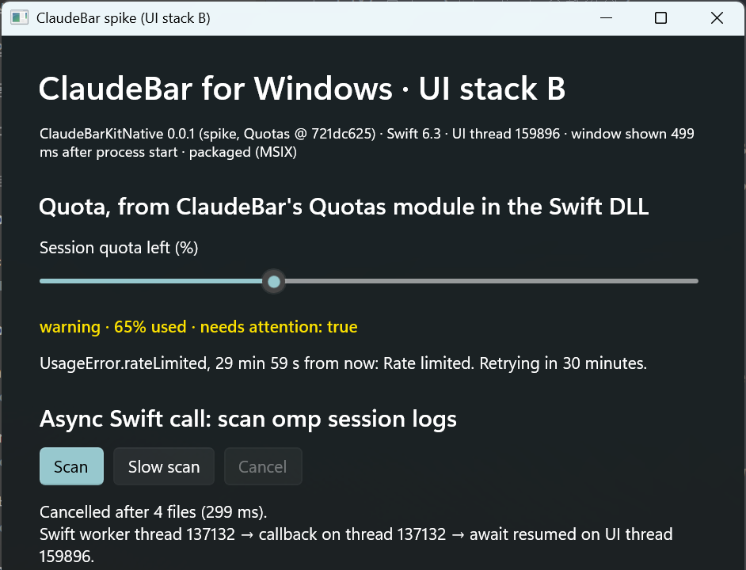

# Spike: UI stack B — C# WinUI 3 calling ClaudeBar's Swift code

The Windows client's UI isn't chosen yet. This spike tests one candidate end to end: a C# WinUI 3 app (Windows App SDK) that calls ClaudeBar's Swift code through a DLL with a C interface. On Windows 11 x64 it works, unpackaged and as MSIX, with JIT and NativeAOT. ARM64 is not proven (see [ARM64](#arm64)).



## What's here

- `native/` — a SwiftPM package that builds `ClaudeBarKitNative.dll`: ClaudeBar's real `Quotas` module ([tddworks/ClaudeBar@721dc625](https://github.com/tddworks/ClaudeBar/tree/721dc625081a040d426857d49328d8685300f26d/Modules/Quotas)) plus C exports written with `@c` (Swift 6.3, [SE-0495](https://github.com/swiftlang/swift-evolution/blob/main/proposals/0495-cdecl.md)). ClaudeBar has no root `Package.swift` yet ([MODULAR_DESIGN §10](https://github.com/tddworks/ClaudeBar/blob/main/docs/architecture/MODULAR_DESIGN.md#10--one-package-two-platforms), phase 1), so `build.ps1` checks the module out at that commit.
- `app/` — the C# WinUI 3 app (.NET 10, Windows App SDK 2.5.1 components). It calls the DLL with `LibraryImport`.
- `build.ps1` — builds the DLL, stages it with the Swift runtime DLLs it imports, and publishes the app.

The app's `--selftest <report.json> --hold <seconds>` runs every check below and writes the results.

### The C interface

- A returned string belongs to the caller, who frees it with `cb_free`.
- Async work returns a handle and replies exactly once, through a C callback on a Swift worker thread. The JSON it passes is valid only during the callback. `cb_cancel(handle)` makes the reply come early with `"cancelled": true`.
- On the C# side each call holds a `GCHandle` to a `TaskCompletionSource` (continuations run asynchronously), so an `await` on the UI thread resumes there, not on the Swift thread.

## Running it

Needs: Swift 6.3.3 (`winget install Swift.Toolchain -e --version 6.3.3`, user scope), the MSVC x64 build tools (`Microsoft.VisualStudio.Component.VC.Tools.x86.x64`), the .NET 10 SDK, and Developer Mode for the MSIX step.

```powershell
.\build.ps1 -Aot
.\out\win-x64-aot\ClaudeBarSpike.exe --selftest report.json --hold 5

.\build.ps1 -Aot -Msix
Add-AppxPackage -Register .\out\win-x64-aot-msix\AppxManifest.xml
claudebar-spike.exe --selftest $PWD\report-msix.json --hold 5
```

## Results

Measured 2026-10-08 on Windows 11 25H2 (build 26200.9457), x64, Swift 6.3.3, .NET SDK 10.0.401, Windows App SDK 2.5.1.

| Check | JIT | NativeAOT | NativeAOT, MSIX |
|---|---|---|---|
| Sync call into `Quotas` (`UsageQuota.status` for 85/35/10/0 %) | ✅ | ✅ | ✅ |
| ICU through Foundation (`UsageError.rateLimited` → "Retrying in 30 minutes") | ✅ | ✅ | ✅ |
| Async call: callback on a Swift thread, `await` resumes on the UI thread | ✅ | ✅ | ✅ |
| Cancel after 300 ms | ✅ | ✅ | ✅ |
| `@MainActor` work runs (with the drain pump, finding 1) | ✅ | ✅ | ✅ |
| No callback left waiting (`GCHandle`s freed) | ✅ | ✅ | ✅ |
| Every Swift and WinUI DLL loads from the app or package folder | ✅ | ✅ | ✅ |
| Theme brush from `Application.Resources` | ✅ | ✅ after finding 2 | ✅ |

| Build | Size on disk | Window shown after process start | Working set / private after the self-test |
|---|---|---|---|
| JIT, `Microsoft.WindowsAppSDK` metapackage | 286.1 MB, 535 files | 671, 918 ms | 148–151 / 96–98 MB |
| NativeAOT, metapackage | 200.7 MB (177.1 MB without `.pdb`) | 441–530 ms (3 runs) | 112 / 89 MB |
| NativeAOT, WinUI components only | 142.5 MB (118.9 MB without `.pdb`) | 417 ms | 112 / 89 MB |
| NativeAOT, WinUI components only, MSIX | 142.5 MB (118.9 MB without `.pdb`) | 558 ms | 111 / 90 MB |

Of the 118.9 MB, Swift is 56.8 MB: `ClaudeBarKitNative.dll` and the 16 runtime DLLs it imports, of which `_FoundationICU.dll` alone is 36.5 MB. The startup times are single runs on one PC, not a benchmark.

## Findings

1. **`@MainActor` code doesn't run unless the host drains Swift's main queue.** On Windows, Swift 6.3's main executor is `DispatchMainExecutor` ([source](https://github.com/swiftlang/swift/blob/release/6.3/stdlib/public/Concurrency/PlatformExecutorWindows.swift)), and WinUI's message loop never drains that queue. Running `RunLoop.main` once per tick did not help. Calling libdispatch's `_dispatch_main_queue_callback_4CF` from a `DispatcherQueue` timer every 16 ms did: the work ran on the UI thread, and the work stuck from earlier ran too. libdispatch lets only the thread its main queue is bound to drain it ([source](https://github.com/swiftlang/swift-corelibs-libdispatch/blob/main/src/queue.c)). Here that was the UI thread, presumably because the UI thread loaded the DLL first; that part is read from the source, not tested. For ClaudeBarKit: either nothing Windows calls is `@MainActor`, or the Windows host runs this pump.
2. **Under NativeAOT, a WinRT object looked up as `object` can come back as the wrong type.** `Application.Current.Resources["SystemFillColorCautionBrush"]` was a `Microsoft.UI.Xaml.DependencyObject`, so the cast to `Brush` failed. An `is SolidColorBrush` check didn't change that. With a call to `WinRT.CastExtensions.As<SolidColorBrush>()` anywhere in the code, the plain cast works. Code that gets WinRT objects back as `object` needs testing under NativeAOT, not just JIT.
3. **Under the .NET 10 SDK, MSIX packaging hides manifest errors.** A malformed `Package.appxmanifest` made `WinAppSdkValidateAppxManifestItems` fail with `FileNotFoundException: System.Security.Permissions, Version=8.0.0.0` instead of the real error, in `Microsoft.Windows.SDK.BuildTools.MSIX` 1.7.251221100 and 1.7.260930100. With that assembly placed next to the task for one build, it reported the actual problem (`APPX1402`, `--` inside an XML comment). Also, the generated `AppxManifest.xml` lands in the build output, not the publish folder; `build.ps1 -Msix` copies it.
4. **SwiftPM on Windows needs the MSVC environment and `SDKROOT`.** `swift build` fails with "could not find CLI tool `link`" until `vcvarsall.bat` has run, and with "unable to load standard library" in a shell started before the Swift installer set `SDKROOT`. `build.ps1` loads `vcvarsall`.
5. **Foundation's directory walk is slower than .NET's.** Walking 2,494 entries under `~\.omp\agent\sessions` took Foundation's `FileManager` 125–332 ms with a warm cache, PowerShell's `Get-ChildItem` 72 ms, and .NET's `EnumerateFileSystemEntries` 25 ms. The first run of all took 17 s; it was not repeated, and its cause is unknown.
6. **The `Microsoft.WindowsAppSDK` metapackage adds 46 MB the UI doesn't use** (`onnxruntime.dll`, `DirectML.dll`, Search). Referencing `Microsoft.WindowsAppSDK.WinUI` (with `InteractiveExperiences` and `Runtime`) leaves them out, and every check still passes.

## ARM64

| Step | Result |
|---|---|
| C# app, JIT, `win-arm64` | ✅ builds; the exe's PE machine is `0xAA64` |
| C# app, NativeAOT, `win-arm64` | ❌ "Platform linker not found … install C++ ARM64 build tools" |
| Swift DLL, `aarch64-unknown-windows-msvc` | ❌ links fail: `msvcrt.lib`, `oldnames.lib`, `msvcprt.lib` not found |
| Swift ARM64 runtime DLLs | The x64 installer ships them only as merge modules (`Redistributables\6.3.3\rtl.arm64.msm`); not unpacked yet |

Both failures need the MSVC ARM64 build tools (`Microsoft.VisualStudio.Component.VC.Tools.ARM64`), which this PC doesn't have. Nothing was run on ARM64 hardware.

## Not covered

- A clean PC without the Swift toolchain. The stand-in: every loaded Swift DLL came from the app or package folder, not from the toolchain on `PATH`.
- A signed `.msix` installed outside Developer Mode, and the Store.
- The tray, taskbar and notification surfaces, and the leaderboard's signing (`CryptoKit` → `Crypto`, phase 2).
